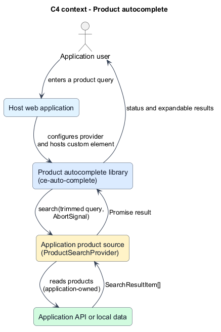
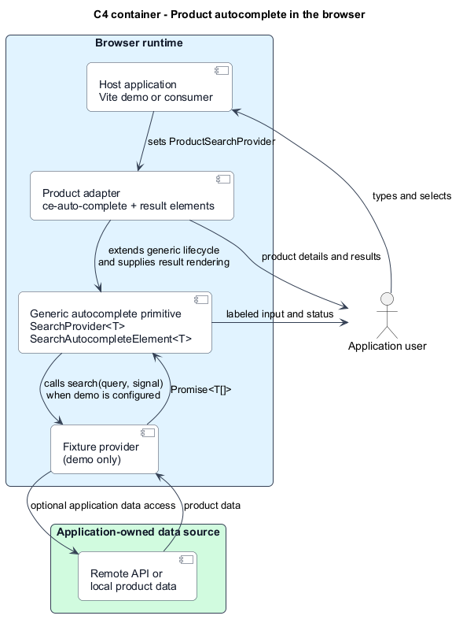
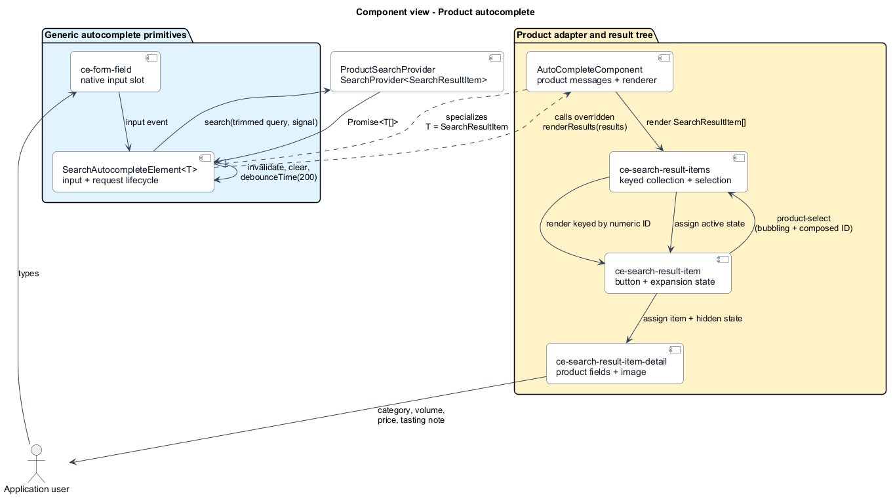
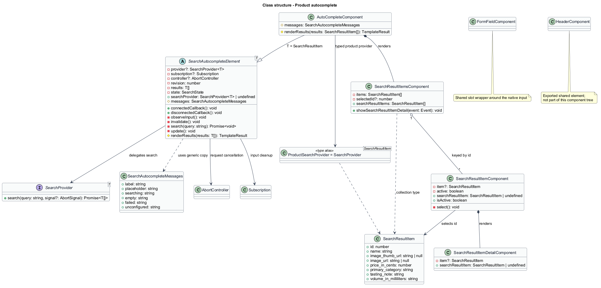
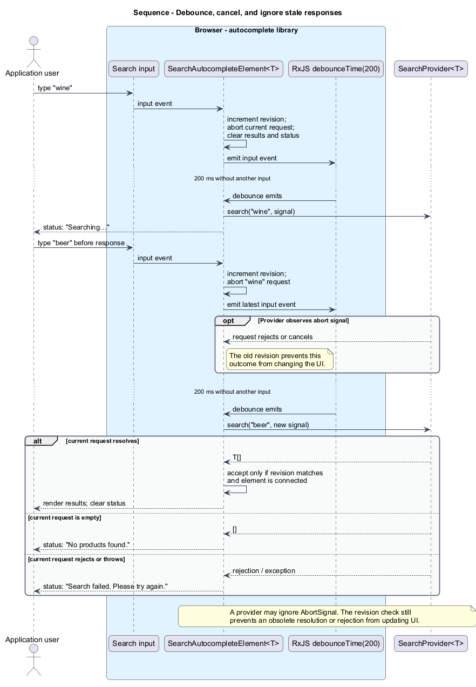
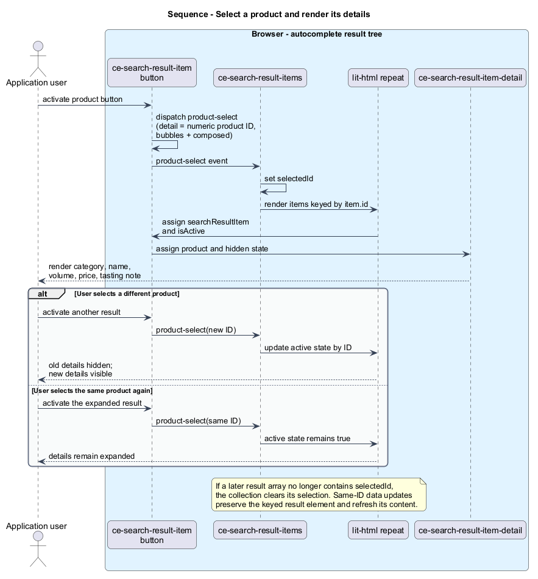

# Product autocomplete

## Overview

`ce-auto-complete` is the product-specific adapter built on the reusable
`SearchAutocompleteElement<T>` primitive. The generic layer owns input and asynchronous search
behavior; the product layer defines product result data and expandable product rendering.

**Provider** — an application-supplied object implementing `SearchProvider<T>.search`

**Query** — the trimmed, nonblank value read from the search input after its debounce

**Revision** — a monotonically increasing token used to reject responses that no longer belong to
the current input, provider, or connection lifecycle

**Result item** — one `SearchResultItem` with the product name, images, category, price, volume, and
tasting note needed by the result components

This is a browser-only library. The generic layer does not prescribe a result shape or renderer; the
product adapter does not fetch a product API itself or validate remote payloads at runtime. Neither
implements the full ARIA combobox pattern.

## Description

The feature is split between a generic primitive and a product adapter:

| Component or type                 | Kind                                           | Responsibility                                                                                                                                                       |
| --------------------------------- | ---------------------------------------------- | -------------------------------------------------------------------------------------------------------------------------------------------------------------------- |
| `SearchAutocompleteElement<T>`    | Abstract generic Web Component base            | Owns the typed `searchProvider`, input subscription, 200 ms debounce, request cancellation, stale-response guard, status messages, and domain result-rendering hook. |
| `SearchProvider<T>`               | Generic TypeScript interface                   | Defines `search(query, signal?)` returning `Promise<T[]>`, independently of domain data.                                                                             |
| `SearchAutocompleteMessages`      | TypeScript interface                           | Defines the accessible label, placeholder, and searching, empty, failed, and unconfigured messages.                                                                  |
| `FormFieldComponent`              | Custom element, `ce-form-field`                | Provides a styled slot around the native input.                                                                                                                      |
| `AutoCompleteComponent`           | Product subclass, `ce-auto-complete`           | Configures product-specific messages and renders the result collection.                                                                                              |
| `ProductSearchProvider`           | Type alias                                     | Specializes `SearchProvider<SearchResultItem>` for product consumers.                                                                                                |
| `SearchResultItem`                | Product TypeScript interface                   | Defines product IDs, names, images, category, price, volume, and tasting note.                                                                                       |
| `SearchResultItemsComponent`      | Custom element, `ce-search-result-items`       | Renders product results keyed by numeric ID and owns which result is expanded.                                                                                       |
| `SearchResultItemComponent`       | Custom element, `ce-search-result-item`        | Renders a native button and an expandable detail element; emits the selected ID.                                                                                     |
| `SearchResultItemDetailComponent` | Custom element, `ce-search-result-item-detail` | Renders the product image, category, name, volume, price, and tasting note.                                                                                          |
| `HeaderComponent`                 | Custom element, `ce-header`                    | Shared slotted header wrapper; not part of the autocomplete result tree.                                                                                             |

`src/autocomplete/index.ts` exports only generic primitives. `src/product-autocomplete/index.ts`
exports the product adapter and result components. `src/index.ts` re-exports both as a compatibility
barrel. The library build exposes the generic and product entries separately as `./autocomplete`
and `./product-autocomplete`, in addition to the root entry. Importing an entry evaluates its
component modules, which register each `ce-*` name only if that name is not already present in the
current `customElements` registry. Components use open Shadow DOM and lit-html rendering; styles
are bundled from their component CSS.

### Reuse in another domain

A domain defines its own result type and extends `SearchAutocompleteElement<T>`. The subclass
implements `renderResults(results)` using that domain's renderer and may override the protected
`messages` getter. It then registers its own custom-element name. This keeps domain data, selection
semantics, result markup, and domain-specific messages out of the generic package.

The product adapter follows that contract: `AutoCompleteComponent` extends
`SearchAutocompleteElement<SearchResultItem>`, supplies the existing product-specific messages, and
renders `ce-search-result-items`. Product expansion, image fallback, and currency formatting remain
in `src/product-autocomplete/`.

### Provider contract

The application assigns a `SearchProvider<T>` through the `searchProvider` property. The provider
receives a trimmed, nonblank query and an `AbortSignal` for the current request. The signal is
optional in the type; providers that support cancellation should forward it to their underlying
work. The generic layer also checks a revision token because a provider may ignore cancellation.

The generic component accepts the provider's promise result as `T[]` and forwards that data to its
subclass's renderer. `ProductSearchProvider` is a type alias for
`SearchProvider<SearchResultItem>`. TypeScript does not validate a remote response at runtime, so a
provider integrating an external service is responsible for validating and mapping that payload.
The library intentionally does not prescribe a network, API, or credentials strategy.

### Search lifecycle

Each input event immediately invalidates the active revision, aborts the current controller, clears
generic results and status, and updates the view. RxJS `debounceTime(200)` delays the next lookup
until input has been quiet for 200 ms. The base reads and trims the input at the point the debounce
emits. Blank text never calls the provider.

When the debounce emits a nonblank query and a provider is configured, the component creates a new
`AbortController`, records the current revision, and shows `Searching…`. The returned promise may
resolve or reject:

| Outcome                                                              | Visible state                                                           |
| -------------------------------------------------------------------- | ----------------------------------------------------------------------- |
| Nonempty result array for the current revision                       | Results render and the status clears.                                   |
| Empty result array for the current revision                          | The result collection is empty and the status says `No products found.` |
| Rejection or synchronous provider exception for the current revision | Results clear and the status says `Search failed. Please try again.`    |
| Any completion for an obsolete revision or disconnected component    | Ignored; it cannot change the current view.                             |

Provider error details are not exposed in the UI. Catching a provider failure keeps the component
usable for later input.

Assigning a provider invalidates pending work, clears prior results and status, and reattaches the
input subscription if connected. It does not automatically search the current input; a later input
event initiates another query. Assigning `undefined` disables the input and shows configuration
guidance.

### Result selection and details

The result collection uses lit-html's keyed `repeat` directive with `item.id`. Each result button
dispatches a bubbling, composed `product-select` event whose `detail` is the numeric ID. The result
collection handles that event and updates its selected ID:

- Selecting a different ID expands that result and collapses the previously selected result.
- Selecting the already-selected ID leaves it expanded.
- Replacing the result array clears selection if its ID is no longer present.
- Updating a result with the same ID reuses its result element and refreshes the button and detail
  content.

The button exposes `aria-expanded` and `aria-controls`; the detail element is hidden while inactive.
The result button is a native button and therefore supports browser keyboard activation.

### Rendering, images, and accessibility boundary

Product strings are passed through lit-html text expressions, not interpreted as HTML. Thumbnails
and detail images use their respective data URLs when present; missing or broken images switch to a
built-in local SVG fallback. The detail image has the product name as its alternative text; result
thumbnails have empty alternative text because the adjacent button text names the result.

The input has a visible label, and status text is in a polite live region. The component does not
implement `role="combobox"`, an active-descendant model, or arrow-key result navigation. The input
currently declares `role="textbox"` while retaining `type="search"`. Product prices are formatted
with a dollar sign and two decimal places; volume is displayed in milliliters. Currency and locale
formatting are not configurable.

### Connection lifecycle and instance isolation

On connection, the component creates an open Shadow Root only if one does not already exist, renders,
and subscribes to the current input's `input` event. Re-observing first unsubscribes the previous
RxJS subscription. On disconnection it unsubscribes, invalidates and aborts pending work, and clears
the loading status. Reconnection reuses the Shadow Root and installs one fresh subscription.

Provider, subscription, controller, revision, results, and status are instance fields. Separate
instances of a generic subclass therefore keep their requests and results independent.

### Local examples and verification

Fixture products, scenario selection, and deterministic delays live under
[`src/components-examples/`](../../../src/components-examples/), outside production components.
The demo provider supports normal, empty, error, slow, stale-response, and unsafe-text scenarios.
The stale scenario intentionally does not honor abort signals so the component's revision guard can
be exercised.

Jest tests cover the generic primitive with an article result type as well as the product subclass:
debounce boundaries, trimming, cancellation, rejected and synchronously thrown provider errors,
stale responses, provider replacement, disconnect/reconnect, independent instances, keyed result
updates, expansion state, image fallback, and text-only product rendering. Playwright acceptance
tests use page objects under `test/e2e/pages/` and cover the integrated product demo, request timing,
stale results, details, recovery, lifecycle, accessibility labeling, responsive widths, and unsafe
text.

## Requirements

The requirement identifiers and acceptance criteria below link to the normative
[L1 specification](../../specs/L1.md) and [L2 specification](../../specs/L2.md).

| L2 ID    | Refines (L1) | Implemented behavior                                                                                                                                                         |
| -------- | ------------ | ---------------------------------------------------------------------------------------------------------------------------------------------------------------------------- |
| `L2-001` | `L1-001`     | Library and demo use the component library; a typed provider supplies the trimmed query and abort signal. Unconfigured elements show guidance and do not request data.       |
| `L2-002` | `L1-002`     | Input waits 200 ms, clears immediately, cancels prior work, and ignores late responses. Replacing the provider cancels work without automatically searching.                 |
| `L2-003` | `L1-002`     | Results show names and thumbnails; selecting a result expands its product details; missing or broken images fall back; same-ID updates are rendered; product markup is text. |
| `L2-004` | `L1-002`     | Loading, empty, and generic failure statuses are rendered, and later queries work after a failure.                                                                           |
| `L2-005` | `L1-001`     | Disconnect cancels work and releases subscriptions; reconnect reuses Shadow DOM and resumes with one subscription; instances keep independent state.                         |
| `L2-006` | `L1-003`     | The local demos provide accessible input labels and status updates, keyboard-operable buttons, responsive layouts, safe text rendering, and local assets.                    |
| `L2-007` | `L1-004`     | Jest unit tests and Playwright acceptance tests exercise the component and demo using controlled providers and page objects.                                                 |

See the linked L2 specification for the exact Given-When-Then acceptance criteria and verification
traceability.

## Diagrams

These diagrams describe the shipped generic primitive and product adapter:

The context view shows the application user, the host application, the autocomplete library, and
the application-owned product source.

The container view places the host and component library in the browser and keeps data access under
the consuming application's control.

The component view follows input events through the generic base and into product result components.

The class view separates the generic provider and base class from product result types and
components.

Typing starts a debounced request; new input aborts the old request and the revision guard rejects
any late response.

Selecting a result updates the active ID, keyed item state, and visibility of the product details.

